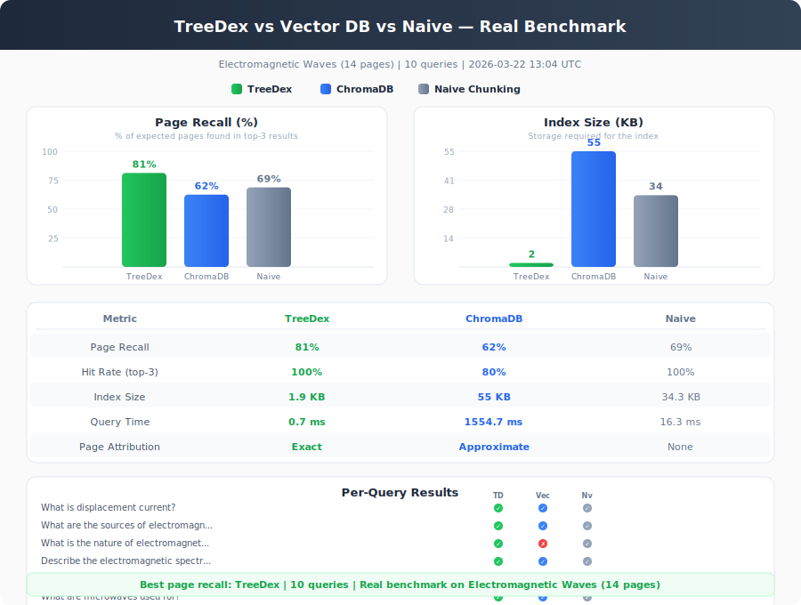
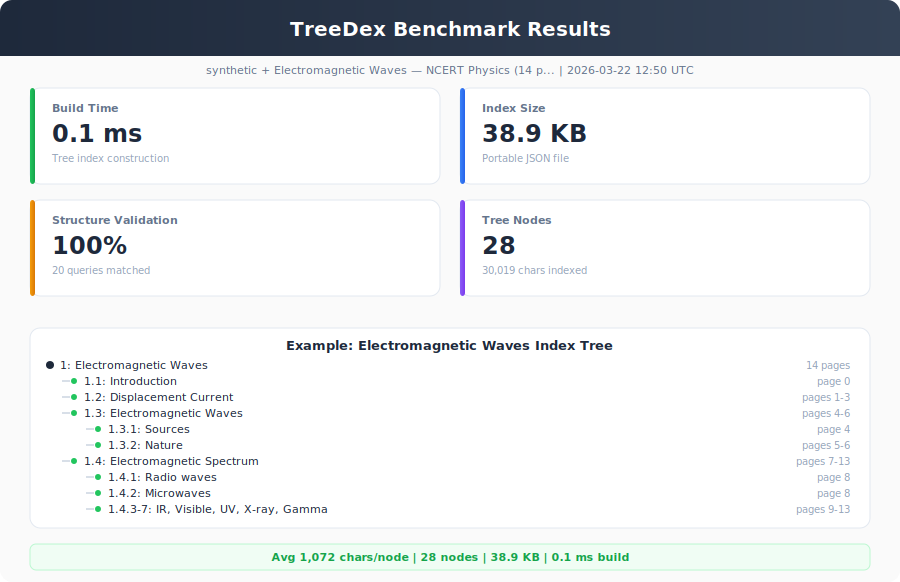

# TreeDex

**Tree-based, vectorless document RAG framework.**

Index any document into a navigable tree structure, then retrieve relevant sections using **any LLM**. No vector databases, no embeddings — just structured tree retrieval.

Available for both **Python** and **Node.js** — same API, same index format, fully cross-compatible.

[](https://colab.research.google.com/github/mithun50/TreeDex/blob/main/treedex_demo.ipynb)
[](https://pypi.org/project/treedex/)
[](https://www.npmjs.com/package/treedex)
[](LICENSE)
[](https://python.org)
[](https://nodejs.org)

---

## How It Works

<p align="center">
  
</p>

1. **Load** — Extract pages from any supported format
2. **Index** — LLM analyzes page groups and extracts hierarchical structure
3. **Build** — Flat sections become a tree with page ranges and embedded text
4. **Query** — LLM selects relevant tree nodes for your question
5. **Return** — Get context text, source pages, and reasoning

### Why TreeDex instead of Vector DB?

<p align="center">
  
</p>

---

## Supported LLM Providers

<p align="center">
  
</p>

TreeDex works with **every major AI provider** out of the box. Pick what works for you:

### One-liner backends (zero config)

| Backend | Provider | Default Model | Python Deps | Node.js Deps |
|---------|----------|---------------|-------------|-------------|
| `GeminiLLM` | Google | gemini-2.0-flash | `google-generativeai` | `@google/generative-ai` |
| `OpenAILLM` | OpenAI | gpt-4o | `openai` | `openai` |
| `ClaudeLLM` | Anthropic | claude-sonnet-4-20250514 | `anthropic` | `@anthropic-ai/sdk` |
| `MistralLLM` | Mistral AI | mistral-large-latest | `mistralai` | `@mistralai/mistralai` |
| `CohereLLM` | Cohere | command-r-plus | `cohere` | `cohere-ai` |
| `GroqLLM` | Groq | llama-3.3-70b-versatile | `groq` | `groq-sdk` |
| `TogetherLLM` | Together AI | Llama-3-70b-chat-hf | **None** | **None (fetch)** |
| `FireworksLLM` | Fireworks | llama-v3p1-70b-instruct | **None** | **None (fetch)** |
| `OpenRouterLLM` | OpenRouter | claude-sonnet-4 | **None** | **None (fetch)** |
| `DeepSeekLLM` | DeepSeek | deepseek-chat | **None** | **None (fetch)** |
| `CerebrasLLM` | Cerebras | llama-3.3-70b | **None** | **None (fetch)** |
| `SambanovaLLM` | SambaNova | Llama-3.1-70B-Instruct | **None** | **None (fetch)** |
| `HuggingFaceLLM` | HuggingFace | Mistral-7B-Instruct | **None** | **None (fetch)** |
| `OllamaLLM` | Ollama (local) | llama3 | **None** | **None (fetch)** |

### Universal backends

| Backend | Use case | Dependencies |
|---------|----------|-------------|
| `OpenAICompatibleLLM` | **Any** OpenAI-compatible endpoint (URL + key) | **None** |
| `LiteLLM` | 100+ providers via litellm library (Python only) | `litellm` |
| `FunctionLLM` | Wrap any function | **None** |
| `BaseLLM` | Subclass to build your own | **None** |

---

## Quick Start

### Install

<table>
<tr><th>Python</th><th>Node.js</th></tr>
<tr><td>

```bash
pip install treedex

# With optional LLM SDK
pip install treedex[gemini]
pip install treedex[openai]
pip install treedex[claude]
pip install treedex[all]
```

</td><td>

```bash
npm install treedex

# With optional LLM SDK
npm install treedex openai
npm install treedex @google/generative-ai
npm install treedex @anthropic-ai/sdk
```

</td></tr>
</table>

### Pick your LLM and go

<table>
<tr><th>Python</th><th>Node.js / TypeScript</th></tr>
<tr><td>

```python
from treedex import TreeDex, GeminiLLM

llm = GeminiLLM(api_key="YOUR_KEY")

index = TreeDex.from_file("doc.pdf", llm=llm)
result = index.query("What is the main argument?")

print(result.context)
print(result.pages_str)  # "pages 5-8, 12-15"
```

</td><td>

```typescript
import { TreeDex, GeminiLLM } from "treedex";

const llm = new GeminiLLM("YOUR_KEY");

const index = await TreeDex.fromFile("doc.pdf", llm);
const result = await index.query("What is the main argument?");

console.log(result.context);
console.log(result.pagesStr);  // "pages 5-8, 12-15"
```

</td></tr>
</table>

### All providers work the same way

<table>
<tr><th>Python</th><th>Node.js / TypeScript</th></tr>
<tr><td>

```python
from treedex import *

# Google Gemini
llm = GeminiLLM(api_key="YOUR_KEY")

# OpenAI
llm = OpenAILLM(api_key="sk-...")

# Claude
llm = ClaudeLLM(api_key="sk-ant-...")

# Groq (fast inference)
llm = GroqLLM(api_key="gsk_...")

# Together AI
llm = TogetherLLM(api_key="...")

# DeepSeek
llm = DeepSeekLLM(api_key="...")

# OpenRouter (access any model)
llm = OpenRouterLLM(api_key="...")

# Local Ollama
llm = OllamaLLM(model="llama3")

# Any OpenAI-compatible endpoint
llm = OpenAICompatibleLLM(
    base_url="https://your-api.com/v1",
    api_key="...",
    model="model-name",
)
```

</td><td>

```typescript
import { /* any backend */ } from "treedex";

// Google Gemini
const llm = new GeminiLLM("YOUR_KEY");

// OpenAI
const llm = new OpenAILLM("sk-...");

// Claude
const llm = new ClaudeLLM("sk-ant-...");

// Groq (fast inference)
const llm = new GroqLLM("gsk_...");

// Together AI
const llm = new TogetherLLM("...");

// DeepSeek
const llm = new DeepSeekLLM("...");

// OpenRouter (access any model)
const llm = new OpenRouterLLM("...");

// Local Ollama
const llm = new OllamaLLM("llama3");

// Any OpenAI-compatible endpoint
const llm = new OpenAICompatibleLLM({
  baseUrl: "https://your-api.com/v1",
  apiKey: "...",
  model: "model-name",
});
```

</td></tr>
</table>

### Wrap any function

<table>
<tr><th>Python</th><th>Node.js / TypeScript</th></tr>
<tr><td>

```python
from treedex import FunctionLLM

llm = FunctionLLM(lambda p: my_api(p))
```

</td><td>

```typescript
import { FunctionLLM } from "treedex";

const llm = new FunctionLLM((p) => myApi(p));
```

</td></tr>
</table>

### Build your own backend

<table>
<tr><th>Python</th><th>Node.js / TypeScript</th></tr>
<tr><td>

```python
from treedex import BaseLLM

class MyLLM(BaseLLM):
    def generate(self, prompt: str) -> str:
        return my_api_call(prompt)
```

</td><td>

```typescript
import { BaseLLM } from "treedex";

class MyLLM extends BaseLLM {
  async generate(prompt: string): Promise<string> {
    return await myApiCall(prompt);
  }
}
```

</td></tr>
</table>

### Swap LLM at query time

```python
# Build index with one LLM
index = TreeDex.from_file("doc.pdf", llm=gemini_llm)

# Query with a different one — same index, different brain
result = index.query("...", llm=groq_llm)
```

### Save and load indexes

Indexes are saved as JSON. An index created in Python loads in Node.js and vice versa.

<table>
<tr><th>Python</th><th>Node.js / TypeScript</th></tr>
<tr><td>

```python
# Save
index.save("my_index.json")

# Load
index = TreeDex.load("my_index.json", llm=llm)
```

</td><td>

```typescript
// Save
await index.save("my_index.json");

// Load
const index = await TreeDex.load("my_index.json", llm);
```

</td></tr>
</table>

---

## Supported Document Formats

| Format | Loader | Python Deps | Node.js Deps |
|--------|--------|-------------|-------------|
| PDF | `PDFLoader` | `pymupdf` | `pdfjs-dist` (included) |
| TXT / MD | `TextLoader` | None | None |
| HTML | `HTMLLoader` | None (stdlib) | `htmlparser2` (optional, has fallback) |
| DOCX | `DOCXLoader` | `python-docx` | `mammoth` (optional) |

Use `auto_loader(path)` / `autoLoader(path)` for automatic format detection.

---

## API Reference

### `TreeDex`

| Method | Python | Node.js |
|--------|--------|---------|
| Build from file | `TreeDex.from_file(path, llm)` | `await TreeDex.fromFile(path, llm)` |
| Build from pages | `TreeDex.from_pages(pages, llm)` | `await TreeDex.fromPages(pages, llm)` |
| Create from tree | `TreeDex.from_tree(tree, pages)` | `TreeDex.fromTree(tree, pages)` |
| Query | `index.query(question)` | `await index.query(question)` |
| Save | `index.save(path)` | `await index.save(path)` |
| Load | `TreeDex.load(path, llm)` | `await TreeDex.load(path, llm)` |
| Show tree | `index.show_tree()` | `index.showTree()` |
| Stats | `index.stats()` | `index.stats()` |
| Find large | `index.find_large_sections()` | `index.findLargeSections()` |

### `QueryResult`

| Property | Python | Node.js | Description |
|----------|--------|---------|-------------|
| Context | `.context` | `.context` | Concatenated text from relevant sections |
| Node IDs | `.node_ids` | `.nodeIds` | IDs of selected tree nodes |
| Page ranges | `.page_ranges` | `.pageRanges` | `[(start, end), ...]` page ranges |
| Pages string | `.pages_str` | `.pagesStr` | Human-readable: `"pages 5-8, 12-15"` |
| Reasoning | `.reasoning` | `.reasoning` | LLM's explanation for selection |

### Cross-language Index Compatibility

TreeDex uses the **same JSON index format** in both Python and Node.js. All field names use `snake_case` in the JSON:

```json
{
  "version": "1.0",
  "framework": "TreeDex",
  "tree": [{ "structure": "1", "title": "...", "node_id": "0001", ... }],
  "pages": [{ "page_num": 0, "text": "...", "token_count": 123 }]
}
```

Build an index with Python, query it from Node.js (or vice versa).

---

## Benchmarks

### TreeDex vs Vector DB vs Naive Chunking

<p align="center">
  
</p>

Real benchmark on the same document (NCERT Electromagnetic Waves, 14 pages, 10 queries). All three methods retrieve from the same content — only the indexing and retrieval approach differs. **Auto-generated by CI on every push.**

### TreeDex Stats

<p align="center">
  
</p>

| Feature | TreeDex | Vector RAG | Naive Chunking |
|---------|---------|------------|----------------|
| **Page Attribution** | Exact source pages | Approximate | None |
| **Structure Preserved** | Full tree hierarchy | None | None |
| **Index Format** | Human-readable JSON | Opaque vectors | Text chunks |
| **Embedding Model** | Not needed | Required | Not needed |
| **Infrastructure** | None (JSON file) | Vector DB required | None |
| **Core Dependencies** | 2 | 5-8+ | 2-5 |

Run your own benchmarks:

```bash
# Python
python benchmarks/run_benchmark.py

# Node.js
npx tsx benchmarks/node/run-benchmark.ts
```

---

## Architecture

<p align="center">
  
</p>

---

## Project Structure

```
treedex/
├── treedex/                # Python package
│   ├── core.py
│   ├── llm_backends.py
│   ├── loaders.py
│   ├── pdf_parser.py
│   ├── tree_builder.py
│   ├── tree_utils.py
│   └── prompts.py
├── src/                    # TypeScript source
│   ├── index.ts
│   ├── core.ts
│   ├── llm-backends.ts
│   ├── loaders.ts
│   ├── pdf-parser.ts
│   ├── tree-builder.ts
│   ├── tree-utils.ts
│   ├── prompts.ts
│   └── types.ts
├── tests/                  # Python tests (pytest)
├── test/                   # Node.js tests (vitest)
├── examples/               # Python examples
├── examples/node/          # Node.js examples
├── benchmarks/             # Python benchmarks
├── benchmarks/node/        # Node.js benchmarks
├── pyproject.toml          # Python package config
├── package.json            # npm package config
├── tsconfig.json           # TypeScript config
└── tsup.config.ts          # Build config (ESM + CJS)
```

---

## Running Tests

<table>
<tr><th>Python</th><th>Node.js</th></tr>
<tr><td>

```bash
pip install -e ".[dev]"
pytest
pytest --cov=treedex
pytest tests/test_core.py -v
```

</td><td>

```bash
npm install
npm test
npm run test:watch
npm run typecheck
```

</td></tr>
</table>

---

## Examples

### Python

```bash
python examples/quickstart.py path/to/document.pdf
python examples/multi_provider.py
python examples/custom_llm.py
python examples/save_load.py path/to/document.pdf
```

### Node.js

```bash
npx tsx examples/node/quickstart.ts path/to/document.pdf
npx tsx examples/node/multi-provider.ts
npx tsx examples/node/custom-llm.ts
npx tsx examples/node/save-load.ts path/to/document.pdf
```

---

## Contributing

```bash
git clone https://github.com/mithun50/TreeDex.git
cd TreeDex

# Python development
pip install -e ".[dev]"
pytest

# Node.js development
npm install
npm run build
npm test
```

---

## License

MIT License — Mithun Gowda B
