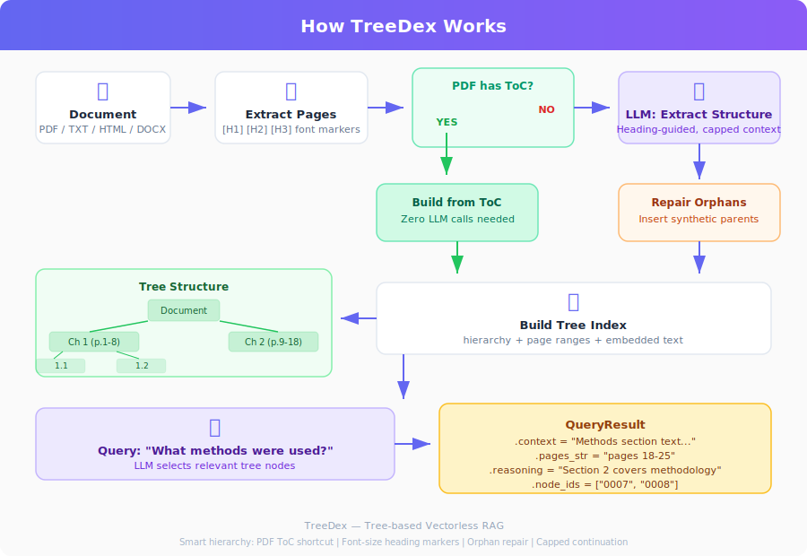
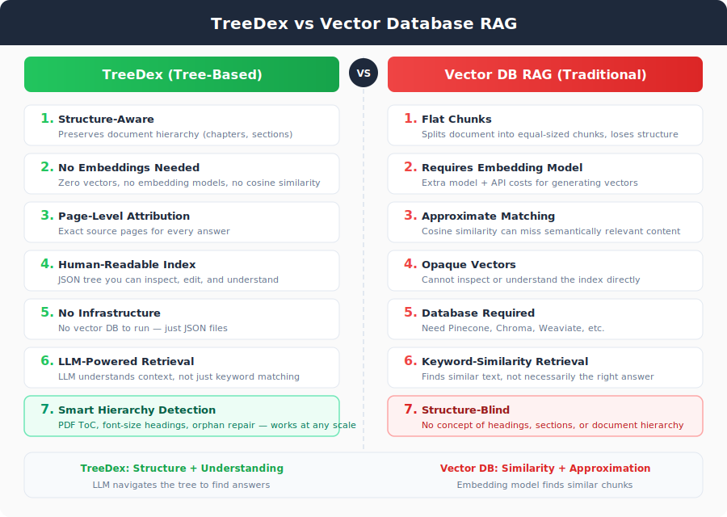
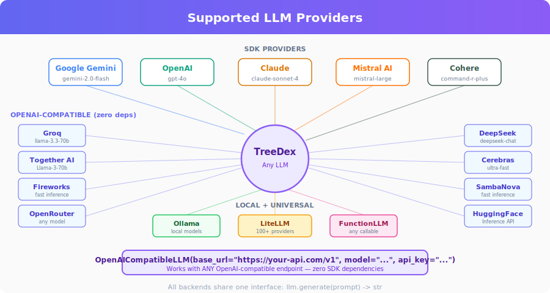
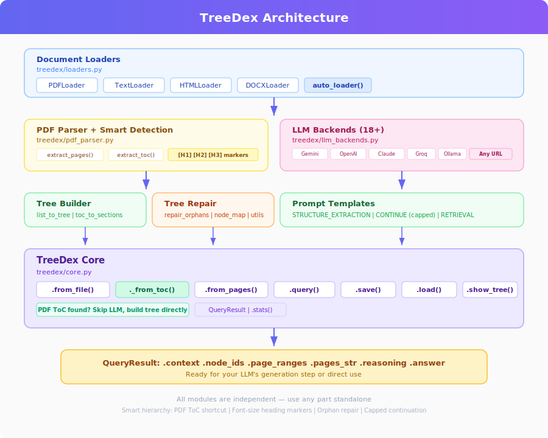

# TreeDex

**Tree-based, vectorless document RAG framework.**

Index any document into a navigable tree structure, then retrieve relevant sections using **any LLM**. No vector databases, no embeddings — just structured tree retrieval.

[](https://colab.research.google.com/github/mithun50/TreeDex/blob/main/treedex_demo.ipynb)
[](https://pypi.org/project/treedex/)
[](LICENSE)
[](https://python.org)

---

## How It Works

<p align="center">
  
</p>

1. **Load** — Extract pages from any supported format
2. **Index** — LLM analyzes page groups and extracts hierarchical structure
3. **Build** — Flat sections become a tree with page ranges and embedded text
4. **Query** — LLM selects relevant tree nodes for your question
5. **Return** — Get context text, source pages, and reasoning

### Why TreeDex instead of Vector DB?

<p align="center">
  
</p>

---

## Supported LLM Providers

<p align="center">
  
</p>

TreeDex works with **every major AI provider** out of the box. Pick what works for you:

### One-liner backends (zero config)

| Backend | Provider | Default Model | Dependencies |
|---------|----------|---------------|-------------|
| `GeminiLLM` | Google | gemini-2.0-flash | `google-generativeai` |
| `OpenAILLM` | OpenAI | gpt-4o | `openai` |
| `ClaudeLLM` | Anthropic | claude-sonnet-4-20250514 | `anthropic` |
| `MistralLLM` | Mistral AI | mistral-large-latest | `mistralai` |
| `CohereLLM` | Cohere | command-r-plus | `cohere` |
| `GroqLLM` | Groq | llama-3.3-70b-versatile | **None (stdlib)** |
| `TogetherLLM` | Together AI | Llama-3-70b-chat-hf | **None (stdlib)** |
| `FireworksLLM` | Fireworks | llama-v3p1-70b-instruct | **None (stdlib)** |
| `OpenRouterLLM` | OpenRouter | claude-sonnet-4 | **None (stdlib)** |
| `DeepSeekLLM` | DeepSeek | deepseek-chat | **None (stdlib)** |
| `CerebrasLLM` | Cerebras | llama-3.3-70b | **None (stdlib)** |
| `SambanovaLLM` | SambaNova | Llama-3.1-70B-Instruct | **None (stdlib)** |
| `HuggingFaceLLM` | HuggingFace | Mistral-7B-Instruct | **None (stdlib)** |
| `OllamaLLM` | Ollama (local) | llama3 | **None (stdlib)** |

### Universal backends

| Backend | Use case | Dependencies |
|---------|----------|-------------|
| `OpenAICompatibleLLM` | **Any** OpenAI-compatible endpoint (URL + key) | **None (stdlib)** |
| `LiteLLM` | 100+ providers via litellm library | `litellm` |
| `FunctionLLM` | Wrap any `callable(str) -> str` | **None** |
| `BaseLLM` | Subclass to build your own | **None** |

---

## Quick Start

### Install

```bash
# pip
pip install treedex

# uv (faster)
uv pip install treedex

# With optional LLM SDK
pip install treedex[gemini]      # Google Gemini
pip install treedex[openai]      # OpenAI
pip install treedex[claude]      # Anthropic Claude
pip install treedex[mistral]     # Mistral AI
pip install treedex[cohere]      # Cohere
pip install treedex[litellm]     # LiteLLM (100+ providers)
pip install treedex[all]         # Everything

# From source
pip install git+https://github.com/mithun50/TreeDex.git

# Development
git clone https://github.com/mithun50/TreeDex.git
cd TreeDex
pip install -e ".[dev]"
```

### Pick your LLM and go

```python
from treedex import TreeDex

# --- Google Gemini ---
from treedex import GeminiLLM
llm = GeminiLLM(api_key="YOUR_KEY")

# --- OpenAI ---
from treedex import OpenAILLM
llm = OpenAILLM(api_key="sk-...")

# --- Claude ---
from treedex import ClaudeLLM
llm = ClaudeLLM(api_key="sk-ant-...")

# --- Groq (free, fast) ---
from treedex import GroqLLM
llm = GroqLLM(api_key="gsk_...")

# --- Together AI ---
from treedex import TogetherLLM
llm = TogetherLLM(api_key="...")

# --- DeepSeek ---
from treedex import DeepSeekLLM
llm = DeepSeekLLM(api_key="...")

# --- Fireworks ---
from treedex import FireworksLLM
llm = FireworksLLM(api_key="...")

# --- OpenRouter (access any model) ---
from treedex import OpenRouterLLM
llm = OpenRouterLLM(api_key="...", model="anthropic/claude-sonnet-4")

# --- Cerebras ---
from treedex import CerebrasLLM
llm = CerebrasLLM(api_key="...")

# --- SambaNova ---
from treedex import SambanovaLLM
llm = SambanovaLLM(api_key="...")

# --- Mistral AI ---
from treedex import MistralLLM
llm = MistralLLM(api_key="...")  # pip install mistralai

# --- Cohere ---
from treedex import CohereLLM
llm = CohereLLM(api_key="...")  # pip install cohere

# --- HuggingFace ---
from treedex import HuggingFaceLLM
llm = HuggingFaceLLM(api_key="hf_...", model="mistralai/Mistral-7B-Instruct-v0.3")

# --- Local Ollama ---
from treedex import OllamaLLM
llm = OllamaLLM(model="llama3")

# Index and query (same for ALL providers)
index = TreeDex.from_file("document.pdf", llm=llm)
result = index.query("What is the main argument?")
print(result.context)
print(result.pages_str)  # "pages 5-8, 12-15"
```

### Any OpenAI-compatible endpoint

```python
from treedex import OpenAICompatibleLLM

# Works with ANY service that speaks OpenAI format
llm = OpenAICompatibleLLM(
    base_url="https://your-provider.com/v1",
    api_key="...",
    model="model-name"
)
```

### 100+ providers via LiteLLM

```python
from treedex import LiteLLM

# pip install litellm
llm = LiteLLM("gpt-4o")                                    # OpenAI
llm = LiteLLM("anthropic/claude-sonnet-4-20250514")         # Claude
llm = LiteLLM("groq/llama-3.3-70b-versatile")              # Groq
llm = LiteLLM("together_ai/meta-llama/Llama-3-70b-chat-hf")# Together
llm = LiteLLM("bedrock/anthropic.claude-3-sonnet")          # AWS Bedrock
llm = LiteLLM("vertex_ai/gemini-pro")                       # Google Vertex
llm = LiteLLM("azure/gpt-4o")                               # Azure OpenAI
```

### Wrap any function

```python
from treedex import FunctionLLM

# Wrap any callable(str) -> str
llm = FunctionLLM(lambda prompt: my_custom_api(prompt))

# Or a named function
def call_my_model(prompt: str) -> str:
    return requests.post(url, json={"prompt": prompt}).json()["text"]

llm = FunctionLLM(call_my_model)
```

### Build your own backend

```python
from treedex import BaseLLM

class MyLLM(BaseLLM):
    def generate(self, prompt: str) -> str:
        # Your logic here — call any API, local model, etc.
        return my_api_call(prompt)

llm = MyLLM()
index = TreeDex.from_file("doc.pdf", llm=llm)
```

### Swap LLM at query time

```python
# Build index with one LLM
index = TreeDex.from_file("doc.pdf", llm=gemini_llm)

# Query with a different one — same index, different brain
result = index.query("...", llm=groq_llm)
```

---

## Supported Document Formats

| Format | Loader | Extra Dependencies |
|--------|--------|--------------------|
| PDF | `PDFLoader` | `pymupdf` |
| TXT / MD | `TextLoader` | None |
| HTML | `HTMLLoader` | None (stdlib) |
| DOCX | `DOCXLoader` | `python-docx` |

Use `auto_loader(path)` for automatic format detection, or pass a specific loader:

```python
from treedex import TreeDex, TextLoader

index = TreeDex.from_file("notes.txt", llm=llm, loader=TextLoader())
```

---

## API Reference

### `TreeDex`

| Method | Description |
|--------|------------|
| `TreeDex.from_file(path, llm, ...)` | Build index from a file |
| `TreeDex.from_pages(pages, llm, ...)` | Build from pre-extracted pages |
| `TreeDex.from_tree(tree, pages, llm?)` | Create from existing tree |
| `index.query(question, llm?)` | Retrieve relevant sections |
| `index.save(path)` | Save index to JSON |
| `TreeDex.load(path, llm?)` | Load index from JSON |
| `index.show_tree()` | Print tree structure |
| `index.stats()` | Get index statistics |
| `index.find_large_sections(...)` | Find oversized nodes |

### `QueryResult`

| Property | Type | Description |
|----------|------|-------------|
| `.context` | `str` | Concatenated text from relevant sections |
| `.node_ids` | `list[str]` | IDs of selected tree nodes |
| `.page_ranges` | `list[tuple]` | `[(start, end), ...]` page ranges |
| `.pages_str` | `str` | Human-readable: `"pages 5-8, 12-15"` |
| `.reasoning` | `str` | LLM's explanation for selection |

### LLM Backends

| Backend | Needs SDK? | One-liner |
|---------|-----------|-----------|
| `GeminiLLM(api_key)` | Yes | `GeminiLLM("key")` |
| `OpenAILLM(api_key)` | Yes | `OpenAILLM("sk-...")` |
| `ClaudeLLM(api_key)` | Yes | `ClaudeLLM("sk-ant-...")` |
| `MistralLLM(api_key)` | Yes | `MistralLLM("key")` |
| `CohereLLM(api_key)` | Yes | `CohereLLM("key")` |
| `GroqLLM(api_key)` | No | `GroqLLM("gsk_...")` |
| `TogetherLLM(api_key)` | No | `TogetherLLM("key")` |
| `FireworksLLM(api_key)` | No | `FireworksLLM("key")` |
| `OpenRouterLLM(api_key)` | No | `OpenRouterLLM("key")` |
| `DeepSeekLLM(api_key)` | No | `DeepSeekLLM("key")` |
| `CerebrasLLM(api_key)` | No | `CerebrasLLM("key")` |
| `SambanovaLLM(api_key)` | No | `SambanovaLLM("key")` |
| `HuggingFaceLLM(api_key)` | No | `HuggingFaceLLM("hf_...")` |
| `OllamaLLM(model)` | No | `OllamaLLM("llama3")` |
| `LiteLLM(model)` | Yes | `LiteLLM("gpt-4o")` |
| `FunctionLLM(fn)` | No | `FunctionLLM(my_fn)` |
| `OpenAICompatibleLLM(url, model)` | No | Any endpoint |
| `BaseLLM` (subclass) | No | Your own logic |

---

## Architecture

<p align="center">
  
</p>

## Running Tests

```bash
# Install dev dependencies
pip install -e ".[dev]"

# Run all tests
pytest

# With coverage
pytest --cov=treedex

# Run specific test file
pytest tests/test_core.py -v
```

---

## License

MIT License — Mithun Gowda B
